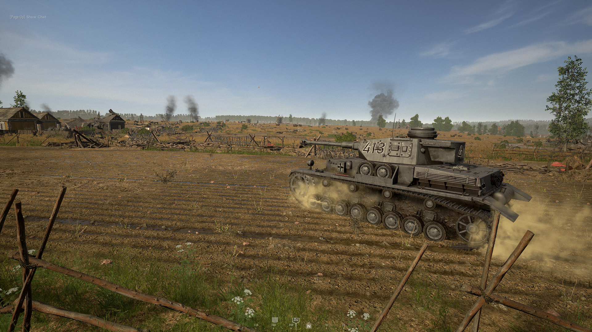

- Released [[2021]] on [[Dec 7th, 2021]].
- Links
	- [[Steam]]
		- https://store.steampowered.com/news/app/686810/view/3139568705206001184
- [[Metagame]]
	- Synced resource generation ([[Resource node]]s will no longer generate resources precisely 60 [[Second]]s from when they were placed but instead generate in sync with [[Ambient resource generation]])
	- Removed the [[Final Stand]] [[Commander ability]]
		- We are temporarily removing the ability as we look at alternative functions that are more balanced
	- The Encouraged [[Commander ability]] now only generates additional resources provided by [[Resource node]]s
	- Added Spawn Medium [[Tank]] as [[US]] [[Commander ability]]
	- Added Spawn Light [[Tank]] as [[Commander ability]]
	- Increased Heavy Tank [[Fuel]] costs from 400 to 600
	- Increased [[Jumbo 75]] [[Fuel]] cost from 300 to 500
- [[Vehicle]] s
	- Added [[Half-track]]s (all factions)
	- Added [[Panzer IV]] ([[Germany]] Medium [[Tank]] )
	- Temporarily Removed [[Panther]]
		- We’ve decided to replace the Panther with the new [[Panzer IV]] as we look to rework its role and update its textures using our improved [[Smart materials]]
	- [[Bombing run]] explosions now deal radial damage to Light Armoured parts of [[Vehicle]]s (Recon vehicles, [[Tank tracks]], etc.)
	- Added [[Fire]] PFX to give a visual aid of when a [[Tank]]’s engine is destroyed
	- Improved detection of radial damage against [[Vehicle]]s
		- [[Tree]]s and other objects are less likely to block incoming damage if the vehicle isn’t entirely obscured
	- Reduced the [[Damage]] of [[Recon vehicle]]s from `400` to `200`
	- Increased [[Cooldown]] of the [[Sherman 76]] to be in line with other Heavy [[Tank]]s
- Weapons
	- Added [[Winchester 1897]] Trench Gun ([[US]] [[Level 3]] [[Engineer]] and [[Assault]])
	- Added [[FG42]] - 20 Mag ([[Germany]] [[Automatic Rifleman]] [[Level 6]])
	- Added [[FG42]] - 10 Mag Scoped ([[Germany]] [[Sniper]] [[Level 3]])
	- Increased penetration power of [[Anti-tank gun]]s allowing them to penetrate Heavy armour if angled correctly
	- [[Bazooka]]s and [[Panzerschreck]]s can now deal radial damage to [[Truck]]s
- [[Loadout]]s
	- Swapped the [[Level 3]] loadout with the [[Level 6]] loadout for the [[Germany]] and [[US]] [[Anti-tank soldier]]
- Gameplay/Features
	- Added additional filtering options and improvements to [[Streamer mode]]
	- Placing a deployable while at build limit will now replace the oldest existing deployable of the same kind
	- Added the ability to test your [[Microphone]] in the [[Audio]] settings
	- Improved [[Bullet penetration]] reliability on a variety of assets across the game
- Added the following [[Achievement]]s
	- Silent, but Deadly!
	- Cutting Edge Tools
	- Ace of Spades
	- Ka-Tonk!
	- Defender of the Motherland
	- To the Village of my Babushka
	- It's not the size that matters
	- Command and Conquer!
	- Overachiever!
	- Jack of all Trades!
- Maps
	- Added the following maps:
	- [[Purple Heart Lane]] [[Offensive mode]] for [[Germany]], `purpleheartlane_offensive_ger`
	- [[Foy]] [[Offensive mode]] for [[US]], `foy_offensive_us`
	- [[Hill 400]] [[Offensive mode]] for [[Germany]], `hill400_offensive_ger`
	- [[Carentan]] [[Offensive mode]] for [[Germany]], `carentan_offensive_ger`
- HUD/UI
	- Added [[Nameplate occlusion]] (off by default)
	- Updated [[Purple Heart Lane]] [[Tactical map]] to better distinguish [[River]]s from [[Road]]s
	- Added a Friends and History tab to the Enlist Screen
	- Added a Last Played On date for servers on the Enlist Screen
	- Added keybinds to the UI when inside a [[Vehicle]]
	- Redesigned the invalid [[Spawn]] location [[Notification]]
	- Critical Player Indicators for [[Medic]]s will now pulse, and will pulse faster as the player has lower [[Health]] or reaches death
	- [[Enemy]] role and unit information is now hidden on the [[Scoreboard]]
	- [[Anti-tank gun]] map icons now rotate based on their direction
	- Updated a number of [[Commander ability]] descriptions to provide more information
	- Added a ping animation to the Player Icon on the [[Tactical map]] to assist in identifying your current location
	- Organized the gameplay settings [[Menu]] into sub-categories for easier navigation
- Sounds
	- Implemented Audio Occlusion to all in-game SFX
	- Improved the distinction of single shot SFX when firing certain weapons
	- Added SFX for when a [[Vehicle]]’s component is destroyed (eg. [[Tank tracks]], hull, engine, turret)
	- Tweaked bullet flyby ‘crack’ SFX
- Updated SFX for the following weapons
	- [[M1 Garand]]
	- [[Browning M1919]]
	- [[M1903 Springfield]]
	- [[MP40]]
	- [[STG]]
	- [[MG42]]
- [[Animation]]
	- Added character poses to the Barracks and in-game [[Loadout]] screens
- [[Server administration]]
	- Added [[Vote kick]] immunity to server admins (Owner, Senior, Junior)
	- Added [[Idle kick]] immunity to Server Admins (Owner, Senior, Junior, Spectator)
	- Highlighting any [[Vehicle]] with the [[Admin camera]] now displays its name
	- Added current player count to [[Admin camera]] search menu
	- [Fixed] Missing player icon when aiming at a [[Enemy]] occupied [[Vehicle]]
- Bug Fixes
	- [Fixed] [[Sniper]] rifle sometimes fails to auto chamber a round.
	- [Fixed] Explosion SFX would often not play when dying inside a vehicle
	- [Fixed] Ragdoll is teleported when the player dies in the [[Soviet]] [[Artillery]] gun
	- [Fixed] The [[Engineer]]s are not awarded [[Experience]] if their level 0 ghost structures are upgraded to level 1 by other players
	- [Fixed] [[Sniper]]s scopes reticles won't move while crouching or moving the camera in [[ADS]]
	- [Fixed] The Start/Stop Engine UI will overlap the Exit Vehicle UI if both inputs are pressed simultaneously
	- [Fixed] The 'Dropping Supplies' UI will overlap with the 'Switching Seats' UI if both inputs are pressed simultaneously
	- [Fixed] Incorrect placement for the satchel when attempting to use it on the front curves of the RUS Heavy Tank
	- [Fixed] Player [[Corpse]]s block constructible blueprints from being built/upgraded
	- [Fixed] Debug text "Army name" appears for a split second on the Unit Select screen
	- [Fixed] The 660 [[Second]] (11 minute) cooldown for the player that initiates a vote to kick is not retained after leaving the server
	- [Fixed] "Cancel Deployment" overlaps with the deploy timer in some non-English languages
	- [Fixed] The Aspect Ratio Constraint Mode settings overlap with the UI arrows when playing in some non-English languages
	- [Fixed] Debug text {STATE} is briefly visible when transitioning between seats in the [[Anti-tank gun]]
	- [Fixed] Losses count towards the Offensive Master and Warfare Master [[Achievement]] s
	- [Fixed] Opening the map as a [[Commander]] will trigger the " [[Commander ability]]s" HINT to replay multiple times
	- [Fixed] Both [[Recon vehicle]]’s [[Speedometer]]s read as 0KM/H when reversing.
	- [Fixed] Killing teammates with [[Headshot]]s will count towards the 'Ding!' [[Achievement]]
	- [Fixed] AA Quality has option 'Low' instead of 'Off'
	- [Fixed] [[Soviet]] Tank Commander Mechanic loadout thumbnail image does not display correctly
	- [Fixed] When using [[Satchel]]s and [[Anti-tank mine]]s, players do not get [[Experience]], "Destroyed [[Vehicle]]s" player stats, or unlock [[Achievement]]s for vehicle kills while dead
	- [Fixed] After changing video settings and pressing the "Back" button the settings still apply
	- [Fixed] The Game Mode hint appears immediately upon joining a server
	- [Fixed] Actions performed with Enter are performed when holding Alt.
	- [Fixed] When driving [[Tank]]s through wheat fields the wheat stalks can be seen to clip into the tank interior
	- [Fixed] When a hint is on screen, the player cannot interact with the [[Map]] or [[Commander ability]]s
	- [Fixed] Calling in the [[Supply drop]] ability inside the Warm-Up blocking volume causes the [[Supplies]] to slide across the environment
	- [Fixed] Equipping the PPSH-41 w/ Drum causes the player's left wrist to become misshapen
	- [Fixed] Updated a number of outdated [[Field Manual]] entries
	- [Fixed] Updated a number of outdated [[Hint]]s
	- [Fixed] The names of the Precision Aim keybindings are not differentiated between Gunner & [[Artillery]]
	- [Fixed] Players can join a [[Team]] which should be locked as it is at capacity
	- [Fixed] Using Alt+Enter often triggers a confirmation prompt
	- [Fixed] No [[Mouse]] cursor is visible when the resolution confirmation message appears after pressing 'ALT + ENTER' while in-game
	- [Fixed] Selecting 'NO' after pressing 'ALT + ENTER' on the IIS/Front End does not reset the screen resolution
	- [Fixed] Voice chat remains active after a specific key combo
	- [Fixed] The application does not launch in Fullscreen when launched through Big Picture
	- [Fixed] [[Hint]]s which appear when the player is in a [[Tank]] can overlap with the Tank UI in many resolutions.
	- [Fixed] [[Hint]]s appearing can overlap with the player's Inventory UI
	- [Fixed] When loading into a [[Server]] the force select screen shows 34 players per [[Team]] before correcting and jumping position on screen
	- [Fixed] Attempting to navigate the Game Menu with a [[Controller]] while in the Change Role menu, causes focus to switch between both menus
	- [Fixed] The game window's title bar is off-screen when setting the application to windowed mode.
	- [Fixed] Placing ghost structures will count towards the 'A Piece of Perfection' [[Achievement]]
	- [Fixed] Debug text will be displayed in the [[Field Manual]] if a mentioned keybinding is unbound
	- [Fixed] Unbinding certain keybindings from a different page of the 'Keybindings' menu will cause inconsistent text to be displayed
	- [Fixed] Player's name is flickering on the [[vehicle]] HUD
	- [Fixed] Visual issue with tank reticles on ultrawide monitors
	- [Fixed] Leadership [[VoIP]] channel may fail for [[Officer]] role immediately after joining a server
	- [Fixed] A player leaving the Enlist screen while a different Enlist screen tab is being loaded will see the results for that tab when returning to the Enlist screen
	- [Fixed] If a player opens the [[Map]] and aims down sights at the exact same time, when they close the map they will [[ADS]] without pressing the key.
	- [Fixed] Reloading and opening/closing the map, while holding/releasing left mouse button, will make guns shoot without any player input
	- [Fixed] Gun will continuously fire after placing an object then opening/closing the map
	- [Fixed] Flickering VFX when aiming with the visual sphere aid in the [[Recon vehicle]] at different objects
	- [Fixed] Holding [LMB], while tapping [W] or [SHIFT] button, triggers the weapon to fire
	- [Fixed] [[Fuel]] and [[Manpower]] [[resource node]] hints will disappear after 1 [[Second]] when selected
	- [Fixed] Jumping multiple times in a row causes player [[Camera]] to jerk during jump animation
	- [Fixed] [[PTRS]] can destroy [[Outpost]]s and [[Garrison]]s
	- [Fixed] [[Germany]] Heavy [[Tank]] is observed to slightly slide when parked horizontally on an angled surface
	- [Fixed] The game displays in a small window while alt-tabbed after changing from Low Resolution & Windowed to High Resolution & Fullscreen
	- [Fixed] There is no tooltip for the [[Airhead]] in the Map Key
	- [Fixed] A banned player does not receive a reason in the Notice Prompt after being kicked by vote
	- [Fixed]  [[Germany]] level 3 barricade sandbags have no bullet collision
	- [Fixed] Misaligned Terrain in the Front End background
	- [Fixed] Flickering textures are present on the window frame of the [[US]] & [[Germany]] [[Recon vehicle]]s when driving
	- [Fixed]  [[Field Manual]]  [[Sainte-Marie-du-Mont]] [[Map]] is outdated
	- [Fixed] Discrepancy between cooldown of the tanks: [[Tiger]] and [[Jumbo 76]]
	- [Fixed] When locked to a target in the [[Admin camera]], some keybinds on the UI are displayed incorrectly.
	- [Fixed] [[Smoke grenade]] detonates again on respawn
	- [Fixed] There is a non-functional Back button in the Personal Stats page of the [[Scoreboard]]
	- [Fixed] There is an ineffectual scroll bar in the Gameplay Options [[Menu]]
	- [Fixed] Inconsistency issue present when throwing grenades through hedges
	- [Fixed] Flickering textures are present on the window frame of the US & German [[Recon vehicle]]s when driving
	- [Fixed] If a player in the last 3 [[Second]]s of deploying is team switched using the [[RCON]] tool they spawn on that location as a member of the other team
	- [Fixed] The Change Role screen UI can briefly flicker and resize if the unit leader clicks on the screen background
	- [Fixed] The Change Role screen UI can briefly flicker and resize starting with the second time the player enters the menu and clicks on the screen background
	- [Fixed] Using RMB on the Front End background causes the UI SFX to be played
	- [Fixed] 'Garrison' and 'Munitions Node' have the incorrect map key tooltips
	- [Fixed] Remove the word [[Hardcore]] from the [[Profanity filter]]
	- [Fixed] The [[Text chat]] window is closed if the player has a [[Spawn]] location selected and it becomes unavailable
	- [Fixed] Issue present with map tooltips when displayed outside of the map boundaries
	- [Fixed] Switching loadouts in the Barracks and Change Role menu with a controller does not show the correct equipment
	- [Fixed] Joining a server cannot be cancelled when using a [[Controller]]
	- [Fixed] Changing the FX Quality setting can cause the first bullet shot to remain visible in FPP
	- [Fixed] When a player creates a unit or exits the Change Role menu they will have no "Leave Unit" button
	- [Fixed] Unable to dismantle the [[Airhead]] if it's deployed inside [[Barbed wire]]
	- [Fixed] [[Field Manual]] The Elevate Up/Down keys in the Anti Tank Gun page are inverted
	- [Fixed] [[Field Manual]] The Increase/Decrease Elevation keys in the Artillery page are inverted
	- [Fixed] Enlist Screen - Controller has no function until mouse is clicked on this menu
	- [Fixed] Barracks "Appearance" and "Loadout" buttons are not properly highlighted
	- [Fixed] The [[Sprint]] and Steady Aim keybinds can conflict when being changed back to their default bindings
	- [Fixed] The [[VoIP]] Connection Status buttons show the wrong function
	- [Fixed] Buttons from deployment menu disappear after inviting a player in the [[Squad]]
	- [Fixed] The [[Text chat]] window is closed during the phases of the [[Victory]]/[[Defeat]] screen
	- [Fixed] Players can still use [[VoIP]] chat after they are kicked or banned from the server
	- [Fixed] While being banned by administrator, when trying to rejoin the server, the notice received is in [[German language]]
	- [Fixed] Favourite role icon is not immediately visible and only appears when other roles are selected
	- [Fixed] Gear in [[Tank]]s changes from Reverse to Gear 1 after the [[Tank tracks]] are destroyed
	- [Fixed] DFAO is creating visual issues in maps.
	- [Fixed]  [[Grenade]] s will clip into the [[Turret]] body section of all [[Tank]]s
- [[Stalingrad]]
	- [Fixed] Multiple assets floating/misaligned
	- [Fixed] Multiple assets with incorrect LoD transition distances
	- [Fixed] Multiple assets with incorrect player collision
	- [Fixed] Multiple assets with incorrect or misaligned bullet collision
	- [Fixed] Some terrain can be seen to change shape when the player enters [[ADS]]
- [[Kursk]]
	- [Fixed] Multiple assets floating/misaligned
	- [Fixed] Multiple assets with incorrect player collision
	- [Fixed] Multiple assets with incorrect or misaligned bullet collision
	- [Fixed] Multiple assets with incorrect bullet PFX/SFX
- [[Sainte-Marie-du-Mont]]
	- [Fixed] Multiple assets floating/misaligned
	- [Fixed] Multiple assets with incorrect or misaligned bullet collision
	- [Fixed] Multiple assets with incorrect player collision
	- [Fixed] Multiple assets with incorrect bullet PFX/SFX
	- [Fixed] [[Belgian Gate]]s found throughout the map vanish when hit with any firearm
	- [Fixed] House in [[Rue De La Gare]] has a LoD transition issue
	- [Fixed] Stone house has a Z-Fighting issue between textures
- [[Hürtgen Forest]]
	- [Fixed] Multiple assets floating/misaligned
	- [Fixed] Multiple assets with incorrect player collision
	- [Fixed] Camera moves abruptly in FPP while moving on a stack of shells
	- [Fixed] There is an LoD transition issue with a building row asset near a bridge
	- [Fixed] Some sets of 3 Dragon Teeth assets can be destroyed by shooting them with any firearm
	- [Fixed] A preplaced [[Belgian Gate]] can be destroyed with firearms
	- [Fixed] Bullets fail to go through some holes in the bunker ruins
- [[Hill 400]]
	- [Fixed] Multiple assets floating/misaligned
	- [Fixed] Multiple assets with incorrect LoD transition distances
	- [Fixed] Multiple assets with incorrect or misaligned bullet collision
	- [Fixed] Multiple assets with incorrect bullet PFX/SFX
	- [Fixed] Tessellation issue present on the muddy terrain throughout the map when the player is using [[ADS]]
	- [Fixed] Player appears to be floating when viewed from third person view, when a player is prone inside a specific trench
	- [Fixed] Navigating far enough in the [[Water]] with a vehicle/character, the user can reach a "kill volume" which instantly kills and destroys the [[Vehicle]] /user
- [[Foy]]
	- [Fixed] Multiple assets floating/misaligned
	- [Fixed] Multiple assets with incorrect or misaligned bullet collision
	- [Fixed] Terrain is too steep in a specific location and blocks player movement
	- [Fixed] Players are able to see off the edge/underneath the map
	- [Fixed] [[Barbed wire]] asset with missing functionality
	- [Fixed] A Z-fighting issue is present on the roof inside the Corbu Factory building
	- [Fixed] One of the windows located in the building at the Cobru Farm cannot be accessed from the outside
- [[Omaha Beach]]
	- [Fixed] Multiple assets floating/misaligned
	- [Fixed] Multiple assets with incorrect LoD transition distances
	- [Fixed] Multiple assets with incorrect or misaligned bullet collision
	- [Fixed] Multiple assets with incorrect vehicle collision
	- [Fixed] Invisible stairs and floor present on a warehouse
	- [Fixed] Loud burning SFX can be heard inside and outside the church
	- [Fixed] When deploying on the Higgins Boat, the boat is seen to visibly shudder whilst moving.
	- [Fixed] Player is unable to deploy machine guns on certain bunkers windows
- [[Utah Beach]]
	- [Fixed] Multiple assets floating/misaligned
	- [Fixed] Multiple assets with incorrect or misaligned bullet collision
- [[Carentan]]
	- [Fixed] Multiple assets floating/misaligned
	- [Fixed] Multiple assets with incorrect LoD transition distances
	- [Fixed] Multiple assets with incorrect or misaligned bullet collision
	- [Fixed] Player can see below the map when going prone on a specific dirt mound
	- [Fixed] Players cannot jump/vault over a [[Fence]] asset in a specific area in Sector C8
- [[Sainte-Mère-Église]]
	- [Fixed] Multiple assets floating/misaligned
	- [Fixed] Multiple assets with incorrect vehicle collision
	- [Fixed] Multiple assets with incorrect LoD transition distances
	- [Fixed] Corrupted texture on a wooden door
	- [Fixed] No splash SFX when walking through water in specific locations
- [[Purple Heart Lane]]
	- [Fixed] Multiple assets floating/misaligned
	- [Fixed] Multiple assets with incorrect player collision
	- [Fixed] Multiple assets with incorrect LoD transition distances
- Known Key Issues
	- Character model's legs and [[Uniform]] can clip through the [[Soviet]] half-track
	- [[Satchel]]s placed on on [[Vehicle]] tracks or barrels may deal less than the required damage to destroy the vehicle
	- [[Revive]]s are not being counted in [[Scoreboard]] or for [[Achievement]] progression
- [[Screenshot]]
	- 